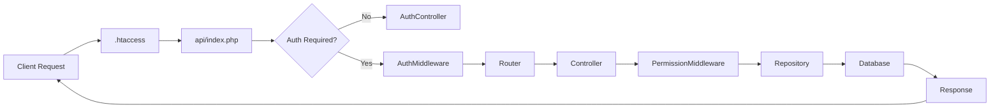

# Controllers

Controllers are the **entry point for all API requests** in MinistryHub. They handle routing, validate permissions, and coordinate between middleware and repositories.

## Request Lifecycle

Every API request follows this flow:



---

## The Router: `api/index.php`

The single entry point for all API calls:

<CodeGroup>
```php api/index.php
<?php

require_once __DIR__ . '/../../backend/src/bootstrap.php';

use App\Controllers\AuthController;
use App\Middleware\AuthMiddleware;
use App\Helpers\Response;

$method = $_SERVER['REQUEST_METHOD'];
$pathParam = $_GET['path'] ?? '';

// Parse URI
$uri = !empty($pathParam) 
    ? $pathParam 
    : str_replace('/api/', '', parse_url($_SERVER['REQUEST_URI'], PHP_URL_PATH));

$parts = explode('/', trim($uri, '/'));
$resource = $parts[0] ?? '';  // e.g., "songs"
$action = $parts[1] ?? '';     // e.g., "123" or "edits"
$method = $_SERVER['REQUEST_METHOD'];  // GET, POST, PUT, DELETE

// ========================================
// PUBLIC ROUTES (No Authentication)
// ========================================
if ($resource === 'auth') {
    $controller = new \App\Controllers\AuthController();
    
    if ($action === 'login' && $method === 'POST') {
        $controller->login();
    }
    elseif ($action === 'verify-invite') {
        $controller->verifyInvitation();
    }
    elseif ($action === 'accept-invite' && $method === 'POST') {
        $controller->acceptInvitation();
    }
    else {
        Response::error("Action not found under auth", 404);
    }
    exit;
}

// ========================================
// PROTECTED ROUTES (Authentication Required)
// ========================================
try {
    $memberId = AuthMiddleware::handle();  // Validates JWT, returns user ID
}
catch (\Exception $e) {
    Response::error($e->getMessage(), 401);
    exit;
}

// Route to appropriate controller
switch ($resource) {
    case 'bootstrap':
        (new \App\Controllers\BootstrapController())->index($memberId);
        break;

    case 'songs':
        (new \App\Controllers\SongController())->handle($memberId, $action, $method);
        break;

    case 'people':
        (new \App\Controllers\PeopleController())->handle($memberId, $action, $method);
        break;

    case 'churches':
        (new \App\Controllers\ChurchController())->handle($memberId, $action, $method);
        break;

    // ... more resources ...

    default:
        Response::error("Resource not found: " . $resource, 404);
}
```
</CodeGroup>

### Routing Pattern

**URL Structure**: `/api/{resource}/{action}`

| URL | Resource | Action | Method | Maps To |
|-----|----------|--------|--------|----------|
| `/api/songs` | `songs` | `` | `GET` | List all songs |
| `/api/songs/123` | `songs` | `123` | `GET` | Get song #123 |
| `/api/songs` | `songs` | `` | `POST` | Create new song |
| `/api/songs/123` | `songs` | `123` | `PUT` | Update song #123 |
| `/api/songs/123` | `songs` | `123` | `DELETE` | Delete song #123 |
| `/api/songs/edits` | `songs` | `edits` | `GET` | List pending edits |
| `/api/auth/login` | `auth` | `login` | `POST` | User login (public) |

---

## Controller Pattern

All resource controllers follow this structure:

<CodeGroup>
```php SongController.php
<?php

namespace App\Controllers;

use App\Middleware\PermissionMiddleware;
use App\Helpers\Response;

class SongController
{
    /**
     * Main handler that routes to specific actions
     */
    public function handle($memberId, $action, $method)
    {
        // Extract church context from request
        $churchId = $_GET['church_id'] ?? null;
        $data = [];
        
        if ($method === 'POST' || $method === 'PUT') {
            $raw = file_get_contents('php://input');
            $data = json_decode($raw, true) ?? [];
            $churchId = $churchId ?? $data['churchId'] ?? null;
        }

        // Check if user is superadmin
        $isSuperAdmin = \App\Repositories\PermissionRepo::isSuperAdmin($memberId);
        
        // If no church specified and not superadmin, use user's church
        if (!$isSuperAdmin && !$churchId) {
            $member = \App\Repositories\UserRepo::getMemberData($memberId);
            $churchId = $member['church_id'];
        }

        // Route based on HTTP method and action
        if ($method === 'GET') {
            if ($action === 'edits') {
                PermissionMiddleware::require($memberId, 'song.approve', $churchId);
                $this->listEdits();
            } 
            elseif (is_numeric($action)) {
                PermissionMiddleware::require($memberId, 'song.read', $churchId);
                $this->show($action);
            } 
            else {
                PermissionMiddleware::require($memberId, 'song.read', $churchId);
                $this->list($memberId, $churchId);
            }
        }
        elseif ($method === 'POST') {
            if ($action === 'propose_edit') {
                $this->proposeEdit($memberId, $data);
            }
            elseif ($action === 'resolve_edit') {
                PermissionMiddleware::require($memberId, 'song.approve', $churchId);
                $this->resolveEdit($memberId, $data);
            }
            else {
                PermissionMiddleware::require($memberId, 'song.create', $churchId);
                $this->create($memberId, $churchId, $data);
            }
        }
        elseif ($method === 'PUT') {
            PermissionMiddleware::require($memberId, 'song.update', $churchId);
            if (is_numeric($action)) {
                $this->update($action, $data);
            }
        }
        elseif ($method === 'DELETE') {
            PermissionMiddleware::require($memberId, 'song.delete', $churchId);
            if (is_numeric($action)) {
                $this->delete((int) $action);
            }
        }
    }

    // ========================================
    // Action Methods
    // ========================================

    private function list($memberId, $churchId = null)
    {
        $songs = \App\Repositories\SongRepo::getAll($churchId);
        
        // Enrich with church names
        $churches = \App\Repositories\ChurchRepo::getAll();
        $churchMap = [];
        foreach ($churches as $c) {
            $churchMap[$c['id']] = $c['name'];
        }
        
        $enrichedSongs = array_map(function ($song) use ($churchMap) {
            $cId = (int) ($song['church_id'] ?? 0);
            $song['church_name'] = ($cId !== 0) 
                ? ($churchMap[$cId] ?? 'Unknown') 
                : null;
            return $song;
        }, $songs);
        
        Response::json(['success' => true, 'songs' => $enrichedSongs]);
    }

    private function show($id)
    {
        $song = \App\Repositories\SongRepo::findById($id);
        
        if ($song) {
            Response::json(['success' => true, 'song' => $song]);
        } else {
            Response::error("Song not found", 404);
        }
    }

    private function create($memberId, $churchId, $input)
    {
        if (!isset($input['title']) || !isset($input['artist'])) {
            return Response::error("Title and Artist are required");
        }

        $id = \App\Repositories\SongRepo::add([
            'church_id' => $churchId ?? 0,
            'title' => $input['title'],
            'artist' => $input['artist'],
            'original_key' => $input['original_key'] ?? '',
            'tempo' => $input['tempo'] ?? '',
            'content' => $input['content'] ?? '',
            'category' => $input['category'] ?? ''
        ]);

        if ($id) {
            Response::json(['success' => true, 'id' => $id, 'message' => 'Song created']);
        } else {
            Response::error("Failed to create song");
        }
    }

    private function update($id, $input)
    {
        if (!$id || !is_numeric($id)) {
            return Response::error("Invalid Song ID");
        }

        $success = \App\Repositories\SongRepo::update($id, $input);
        Response::json([
            'success' => $success, 
            'message' => $success ? 'Song updated' : 'Failed to update song'
        ]);
    }

    private function delete($id)
    {
        $success = \App\Repositories\SongRepo::delete($id);
        Response::json([
            'success' => $success, 
            'message' => $success ? 'Song deleted' : 'Failed to delete song'
        ]);
    }
}
```
</CodeGroup>

---

## Authentication Controller

The `AuthController` handles public authentication endpoints:

<CodeGroup>
```php AuthController.php
<?php

namespace App\Controllers;

use App\Repositories\UserRepo;
use App\Jwt;
use App\Helpers\Response;
use App\Helpers\Logger;

class AuthController
{
    /**
     * POST /api/auth/login
     * Authenticates user with email/password + reCAPTCHA
     */
    public function login()
    {
        $rawInput = file_get_contents("php://input");
        $data = json_decode($rawInput, true);
        
        $email = $data['email'] ?? '';
        $password = $data['password'] ?? '';
        $recaptchaToken = $data['recaptchaToken'] ?? '';

        // Verify reCAPTCHA
        if (!$this->verifyRecaptcha($recaptchaToken)) {
            return Response::error("Security verification failed", 403);
        }

        // Validate input
        if (empty($email) || empty($password)) {
            return Response::error("Email and password are required", 400);
        }

        // Find user
        $user = UserRepo::findByEmail($email);
        
        if (!$user) {
            return Response::error("Invalid credentials", 401);
        }

        // Verify password
        if (!password_verify($password, $user['password_hash'])) {
            Logger::error("Auth failed: Incorrect password for ($email)");
            return Response::error("Invalid credentials", 401);
        }

        Logger::info("Auth success: User ($email) authenticated.");

        // Generate JWT
        $payload = [
            'uid' => $user['member_id'],
            'email' => $user['email'],
            'iat' => time(),
            'exp' => time() + 3600  // 1 hour expiration
        ];

        $token = Jwt::encode($payload);

        return Response::json([
            'success' => true,
            'access_token' => $token,
            'expires_in' => 3600
        ]);
    }

    /**
     * GET /api/auth/verify-invite?token=...
     * Validates an invitation token
     */
    public function verifyInvitation()
    {
        $token = $_GET['token'] ?? '';

        if (empty($token)) {
            return Response::error("Invitation token missing", 400);
        }

        $invitation = UserRepo::findByInviteToken($token);
        
        if (!$invitation) {
            return Response::error("The invitation is invalid or has expired", 400);
        }

        return Response::json([
            'success' => true,
            'invitation' => [
                'name' => $invitation['name'],
                'email' => $invitation['email'],
                'church' => $invitation['church_name'] ?? 'Your Church'
            ]
        ]);
    }

    /**
     * POST /api/auth/accept-invite
     * Completes registration and auto-logs in the user
     */
    public function acceptInvitation()
    {
        $data = json_decode(file_get_contents("php://input"), true);
        $token = $data['token'] ?? '';
        $password = $data['password'] ?? '';

        if (empty($token) || empty($password)) {
            return Response::error("Token and password are required", 400);
        }

        $invitation = UserRepo::findByInviteToken($token);
        
        if (!$invitation) {
            return Response::error("The invitation is invalid or has expired", 400);
        }

        $success = UserRepo::completeInvitation($invitation['id'], $password);

        if ($success) {
            // Generate token for auto-login
            $payload = [
                'uid' => $invitation['id'],
                'email' => $invitation['email'],
                'iat' => time(),
                'exp' => time() + 3600
            ];
            $token = Jwt::encode($payload);

            return Response::json([
                'success' => true,
                'token' => $token,
                'user' => [
                    'id' => $invitation['id'],
                    'email' => $invitation['email']
                ]
            ]);
        }

        return Response::error("Registration could not be completed", 500);
    }

    /**
     * Verifies reCAPTCHA v3 token with Google
     */
    private function verifyRecaptcha($token)
    {
        if (empty($token)) return false;

        $configPath = APP_ROOT . '/config/database.env';
        $env = parse_ini_file($configPath);
        $secret = $env['RECAPTCHA_SECRET_KEY'] ?? '';

        if (empty($secret)) return true;  // Bypass if not configured

        $url = 'https://www.google.com/recaptcha/api/siteverify';
        $data = [
            'secret' => $secret,
            'response' => $token
        ];

        $context = stream_context_create([
            'http' => [
                'header' => "Content-type: application/x-www-form-urlencoded\r\n",
                'method' => 'POST',
                'content' => http_build_query($data),
                'timeout' => 3.0
            ]
        ]);

        $result = @file_get_contents($url, false, $context);
        
        if ($result === false) {
            return true;  // Fallback to true if Google is unreachable
        }

        $response = json_decode($result, true);
        return $response['success'] && ($response['score'] ?? 1.0) >= 0.5;
    }
}
```
</CodeGroup>

---

## Bootstrap Controller

The `BootstrapController` provides initial app data after login:

<CodeGroup>
```php BootstrapController.php
<?php

namespace App\Controllers;

use App\Repositories\UserRepo;
use App\Repositories\PermissionRepo;
use App\Repositories\ChurchRepo;
use App\Helpers\Response;

class BootstrapController
{
    /**
     * GET /api/bootstrap
     * Returns user profile, permissions, church data, and feature flags
     */
    public function index($memberId)
    {
        $member = UserRepo::getMemberData($memberId);
        
        if (!$member) {
            return Response::error("Member not found", 404);
        }

        $church = ChurchRepo::findById($member['church_id']);
        $permissions = PermissionRepo::getPermissions($memberId, $member['church_id']);
        $serviceRoles = PermissionRepo::getServiceRoles($memberId, $member['church_id']);

        $isSuper = PermissionRepo::isSuperAdmin($memberId);
        
        // Build roles array
        $roles = array_map(fn($r) => $r['name'], $serviceRoles);
        if ($isSuper) {
            $roles[] = 'superadmin';
        }
        $roles = array_values(array_unique($roles));

        // Extract service keys
        $serviceKeys = array_values(array_unique(
            array_map(fn($r) => $r['service_key'], $serviceRoles)
        ));

        return Response::json([
            'success' => true,
            'data' => [
                'user' => $member,
                'is_superadmin' => $isSuper,
                'church' => $church,
                'permissions' => $permissions,
                'roles' => $roles,
                'services' => array_unique($serviceKeys),
                'features' => [
                    'music' => in_array('worship', $serviceKeys),
                    'social_media' => in_array('social', $serviceKeys)
                ]
            ]
        ]);
    }
}
```
</CodeGroup>

**Response Example**:
```json
{
  "success": true,
  "data": {
    "user": {
      "id": 123,
      "name": "John Doe",
      "email": "john@church.com",
      "church_id": 5
    },
    "is_superadmin": false,
    "church": {
      "id": 5,
      "name": "Grace Community Church"
    },
    "permissions": [
      "song.read",
      "song.create",
      "song.update"
    ],
    "roles": ["worship_leader"],
    "services": ["worship"],
    "features": {
      "music": true,
      "social_media": false
    }
  }
}
```

---

## Middleware Integration

Controllers work closely with two middleware layers:

### 1. AuthMiddleware (Global)

Validates JWT on every protected route:

```php
// In api/index.php (before routing)
try {
    $memberId = AuthMiddleware::handle();
}
catch (\Exception $e) {
    Response::error($e->getMessage(), 401);
    exit;
}
```

### 2. PermissionMiddleware (Per-Action)

Checks specific permissions before executing controller actions:

```php
// In controller method
PermissionMiddleware::require($memberId, 'song.create', $churchId);
```

See the [Middleware documentation](/technical/php-architecture#middleware) for details.

---

## Controller Best Practices

### ✅ Do's

1. **Always validate input**
   ```php
   if (!isset($input['title']) || !isset($input['artist'])) {
       return Response::error("Title and Artist are required");
   }
   ```

2. **Use repositories for data access** (never query the database directly)
   ```php
   $songs = \App\Repositories\SongRepo::getAll($churchId);
   ```

3. **Check permissions early**
   ```php
   PermissionMiddleware::require($memberId, 'song.delete', $churchId);
   ```

4. **Return consistent JSON responses**
   ```php
   Response::json(['success' => true, 'data' => $result]);
   ```

5. **Log important actions**
   ```php
   Logger::info("Song #$id deleted by member #$memberId");
   ```

### ❌ Don'ts

1. **Never trust user input**
   ```php
   // ❌ BAD: Direct SQL injection risk
   $sql = "SELECT * FROM songs WHERE id = " . $_GET['id'];
   
   // ✅ GOOD: Use prepared statements in repositories
   $song = SongRepo::findById($_GET['id']);
   ```

2. **Don't expose database structure**
   ```php
   // ❌ BAD: Revealing internal column names
   Response::error("Column 'password_hash' not found");
   
   // ✅ GOOD: Generic error messages
   Response::error("Authentication failed");
   ```

3. **Don't perform business logic in controllers**
   ```php
   // ❌ BAD: Complex calculations in controller
   $total = array_sum(array_map(fn($s) => $s['duration'], $songs));
   
   // ✅ GOOD: Move to repository or service class
   $total = SongRepo::getTotalDuration($playlistId);
   ```

---

## Testing Controllers

Use tools like **Postman** or **cURL** to test API endpoints:

### Login and Get Token
```bash
curl -X POST https://your-domain.com/api/auth/login \
  -H "Content-Type: application/json" \
  -d '{
    "email": "user@church.com",
    "password": "password123",
    "recaptchaToken": "test_token"
  }'
```

### Authenticated Request
```bash
curl -X GET https://your-domain.com/api/songs \
  -H "Authorization: Bearer YOUR_JWT_TOKEN_HERE"
```

### Create Resource
```bash
curl -X POST https://your-domain.com/api/songs \
  -H "Authorization: Bearer YOUR_JWT_TOKEN_HERE" \
  -H "Content-Type: application/json" \
  -d '{
    "title": "Amazing Grace",
    "artist": "John Newton",
    "original_key": "G",
    "churchId": 5
  }'
```

---

## Next Steps

<CardGroup cols={2}>
  <Card title="Repositories" icon="database" href="/technical/repositories">
    Learn how data is fetched and persisted
  </Card>
  <Card title="PHP Architecture" icon="code" href="/technical/php-architecture">
    Understand the overall backend structure
  </Card>
</CardGroup>