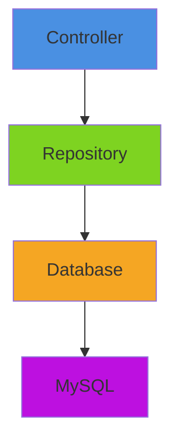

# Repositories

Repositories form the **data access layer** in MinistryHub, providing a clean abstraction between controllers and the database. They encapsulate all SQL queries and use PDO prepared statements for security.

## Architecture Pattern

The **Repository Pattern** separates business logic from data access:



**Benefits**:
- Controllers focus on routing and permissions
- Repositories handle SQL complexity
- Easy to mock for testing
- Database queries are centralized and reusable

---

## Repository Structure

All repositories follow this pattern:

<CodeGroup>
```php Example Repository
<?php

namespace App\Repositories;

use App\Database;
use PDO;

class SongRepo
{
    /**
     * Get all songs, optionally filtered by church
     */
    public static function getAll($churchId = null)
    {
        try {
            $db = Database::getInstance('music');
            $sql = "SELECT * FROM songs WHERE is_active = 1";
            $params = [];

            if ($churchId !== null) {
                // Include church-specific songs AND universal songs (id 0)
                $sql .= " AND (church_id = ? OR church_id = 0)";
                $params[] = $churchId;
            }

            $sql .= " ORDER BY title ASC";
            $stmt = $db->prepare($sql);
            $stmt->execute($params);
            return $stmt->fetchAll(PDO::FETCH_ASSOC);
        } catch (\Exception $e) {
            \App\Helpers\Logger::error("SongRepo::getAll error: " . $e->getMessage());
            return [];
        }
    }

    /**
     * Find a song by ID
     */
    public static function findById($id)
    {
        try {
            $db = Database::getInstance('music');
            $stmt = $db->prepare("SELECT * FROM songs WHERE id = ?");
            $stmt->execute([$id]);
            return $stmt->fetch(PDO::FETCH_ASSOC);
        } catch (\Exception $e) {
            \App\Helpers\Logger::error("SongRepo::findById error: " . $e->getMessage());
            return null;
        }
    }

    /**
     * Add a new song
     */
    public static function add($data)
    {
        try {
            $db = Database::getInstance('music');
            $stmt = $db->prepare("
                INSERT INTO songs (church_id, title, artist, original_key, tempo, content, category, is_active)
                VALUES (?, ?, ?, ?, ?, ?, ?, 1)
            ");
            $stmt->execute([
                $data['church_id'] ?? 0,
                $data['title'],
                $data['artist'],
                $data['original_key'] ?? '',
                $data['tempo'] ?? '',
                $data['content'] ?? '',
                $data['category'] ?? ''
            ]);
            return $db->lastInsertId();
        } catch (\Exception $e) {
            \App\Helpers\Logger::error("SongRepo::add error: " . $e->getMessage());
            return false;
        }
    }

    /**
     * Update an existing song
     */
    public static function update($id, $data)
    {
        try {
            $db = Database::getInstance('music');
            $fields = [];
            $params = [];
            
            // Build dynamic UPDATE query
            foreach ($data as $key => $value) {
                if (in_array($key, ['title', 'artist', 'original_key', 'tempo', 'content', 'category'])) {
                    $fields[] = "$key = ?";
                    $params[] = $value;
                }
            }
            
            if (empty($fields)) return false;

            $params[] = $id;
            $sql = "UPDATE songs SET " . implode(', ', $fields) . " WHERE id = ?";
            $stmt = $db->prepare($sql);
            return $stmt->execute($params);
        } catch (\Exception $e) {
            \App\Helpers\Logger::error("SongRepo::update error: " . $e->getMessage());
            return false;
        }
    }

    /**
     * Delete a song
     */
    public static function delete($id)
    {
        try {
            $db = Database::getInstance('music');
            $stmt = $db->prepare("DELETE FROM songs WHERE id = ?");
            return $stmt->execute([$id]);
        } catch (\Exception $e) {
            \App\Helpers\Logger::error("SongRepo::delete error: " . $e->getMessage());
            return false;
        }
    }
}
```
</CodeGroup>

### Key Characteristics

1. **Static Methods**: All repository methods are static (no need to instantiate)
2. **Type Safety**: Use strict types where possible
3. **Error Handling**: Wrap queries in try-catch blocks
4. **Logging**: Log errors for debugging without breaking the app
5. **PDO Prepared Statements**: ALWAYS use parameterized queries

---

## Multi-Database Access

MinistryHub uses **two separate databases**:

### Main Database (User Data)
```php
$db = Database::getInstance('main');
```
**Contains**:
- `user_accounts` - Login credentials
- `member` - User profiles
- `church` - Church organizations
- `areas` - Ministry areas
- `teams` - Service teams
- `roles` - Permission roles
- `services` - Hub services (worship, social media, etc.)

### Music Database (Content Data)
```php
$db = Database::getInstance('music');
```
**Contains**:
- `songs` - Song library
- `playlists` - Setlists for services
- `instruments` - Musical instruments
- `song_edits` - Pending song change proposals

**Why Separate?**
- **Performance**: Independent scaling and optimization
- **Security**: Isolate sensitive user data from public content
- **Flexibility**: Different backup/replication strategies

---

## UserRepo: Complex Example

The `UserRepo` demonstrates advanced patterns:

<CodeGroup>
```php UserRepo.php
<?php

namespace App\Repositories;

use App\Database;
use PDO;

class UserRepo
{
    /**
     * Find user by email (for login)
     */
    public static function findByEmail($email)
    {
        $db = Database::getInstance();
        $stmt = $db->prepare("
            SELECT u.*, m.name, m.church_id 
            FROM user_accounts u
            JOIN member m ON u.member_id = m.id
            WHERE u.email = ? AND u.is_active = 1
        ");
        $stmt->execute([$email]);
        return $stmt->fetch();
    }

    /**
     * Get full member profile with relationships
     */
    public static function getMemberData($memberId)
    {
        $db = Database::getInstance();
        $stmt = $db->prepare("SELECT * FROM member WHERE id = ?");
        $stmt->execute([$memberId]);
        $member = $stmt->fetch(PDO::FETCH_ASSOC);

        if ($member) {
            // Enrich with related data
            $member['instruments'] = self::getUserInstruments($memberId);
            $member['areas'] = self::getUserAreas($memberId);

            // Get primary role
            $stmt = $db->prepare("
                SELECT r.id, r.name, r.display_name as displayName
                FROM roles r
                JOIN user_service_roles usr ON r.id = usr.role_id
                JOIN services s ON usr.service_id = s.id
                WHERE usr.member_id = ? AND s.key = 'mainhub'
            ");
            $stmt->execute([$memberId]);
            $member['role'] = $stmt->fetch(PDO::FETCH_ASSOC);
        }

        return $member;
    }

    /**
     * Get user's instruments (many-to-many)
     */
    public static function getUserInstruments($memberId)
    {
        $db = Database::getInstance();
        try {
            $stmt = $db->prepare("
                SELECT i.* 
                FROM instruments i
                JOIN member_instruments mi ON i.id = mi.instrument_id
                WHERE mi.member_id = ?
            ");
            $stmt->execute([$memberId]);
            return $stmt->fetchAll(PDO::FETCH_ASSOC);
        } catch (\Exception $e) {
            return [];
        }
    }

    /**
     * Set user instruments (replaces all)
     */
    public static function setUserInstruments($memberId, $instrumentIds)
    {
        $db = Database::getInstance();
        try {
            $db->beginTransaction();

            // Delete old associations
            $stmt = $db->prepare("DELETE FROM member_instruments WHERE member_id = ?");
            $stmt->execute([$memberId]);

            // Insert new associations
            if (!empty($instrumentIds)) {
                $sql = "INSERT INTO member_instruments (member_id, instrument_id) VALUES ";
                $placeholders = [];
                $params = [];
                
                foreach ($instrumentIds as $id) {
                    $placeholders[] = "(?, ?)";
                    $params[] = $memberId;
                    $params[] = $id;
                }
                
                $sql .= implode(", ", $placeholders);
                $stmt = $db->prepare($sql);
                $stmt->execute($params);
            }

            $db->commit();
            return true;
        } catch (\Exception $e) {
            if ($db->inTransaction()) {
                $db->rollBack();
            }
            return false;
        }
    }

    /**
     * Create a new member invitation
     */
    public static function createMember($data)
    {
        $db = Database::getInstance();
        $stmt = $db->prepare("
            INSERT INTO member (church_id, name, surname, email, phone, status, invite_token, token_expires_at)
            VALUES (?, ?, ?, ?, ?, ?, ?, ?)
        ");
        $stmt->execute([
            $data['church_id'] ?? null,
            $data['name'],
            $data['surname'] ?? '',
            $data['email'],
            $data['phone'] ?? null,
            $data['status'] ?? 'pending',
            $data['invite_token'] ?? null,
            $data['token_expires_at'] ?? null
        ]);
        return $db->lastInsertId();
    }

    /**
     * Complete invitation (create user account)
     */
    public static function completeInvitation($memberId, $password)
    {
        $db = Database::getInstance();
        try {
            $db->beginTransaction();

            // Get member data
            $member = self::getMemberData($memberId);
            if (!$member) {
                throw new \Exception("Member not found");
            }

            // Create user account with hashed password
            $passwordHash = password_hash($password, PASSWORD_DEFAULT);
            $stmt = $db->prepare("
                INSERT INTO user_accounts (member_id, email, password_hash, auth_method, is_active)
                VALUES (?, ?, ?, 'password', 1)
                ON DUPLICATE KEY UPDATE password_hash = VALUES(password_hash), is_active = 1
            ");
            $stmt->execute([$memberId, $member['email'], $passwordHash]);

            // Update member status
            $stmt = $db->prepare("
                UPDATE member 
                SET status = 'active', invite_token = NULL, token_expires_at = NULL 
                WHERE id = ?
            ");
            $stmt->execute([$memberId]);

            $db->commit();
            return true;
        } catch (\Exception $e) {
            if ($db->inTransaction()) {
                $db->rollBack();
            }
            \App\Helpers\Logger::error("UserRepo::completeInvitation error: " . $e->getMessage());
            return false;
        }
    }

    /**
     * Hard delete a member and all related data
     */
    public static function hardDelete($memberId)
    {
        $db = Database::getInstance();
        try {
            $db->beginTransaction();
            
            // Delete in order of foreign key dependencies
            $db->prepare("DELETE FROM user_service_roles WHERE member_id = ?")->execute([$memberId]);
            $db->prepare("DELETE FROM user_accounts WHERE member_id = ?")->execute([$memberId]);
            $db->prepare("DELETE FROM group_members WHERE member_id = ?")->execute([$memberId]);
            $result = $db->prepare("DELETE FROM member WHERE id = ?")->execute([$memberId]);
            
            $db->commit();
            return $result;
        } catch (\Exception $e) {
            if ($db->inTransaction()) {
                $db->rollBack();
            }
            throw $e;
        }
    }
}
```
</CodeGroup>

### Advanced Patterns Demonstrated

1. **Eager Loading**: Load related data in one method call
2. **Transactions**: Ensure atomicity for multi-table operations
3. **Dynamic SQL**: Build INSERT statements for variable-length arrays
4. **Cascading Deletes**: Handle foreign key relationships manually
5. **Password Hashing**: Use PHP's `password_hash()` for security

---

## Song Edit Moderation Flow

The `SongRepo` implements a **moderation workflow** where collaborators propose edits that leaders must approve:

<CodeGroup>
```php SongRepo.php (Moderation)
<?php

namespace App\Repositories;

use App\Database;
use PDO;

class SongRepo
{
    /**
     * Propose an edit to a song (stores as JSON)
     */
    public static function proposeEdit($songId, $memberId, $data)
    {
        try {
            $db = Database::getInstance('music');
            $stmt = $db->prepare("
                INSERT INTO song_edits (song_id, member_id, proposed_data, status)
                VALUES (?, ?, ?, 'pending')
            ");
            return $stmt->execute([$songId, $memberId, json_encode($data)]);
        } catch (\Exception $e) {
            \App\Helpers\Logger::error("SongRepo::proposeEdit error: " . $e->getMessage());
            return false;
        }
    }

    /**
     * List all pending edits
     */
    public static function listPendingEdits()
    {
        try {
            $db = Database::getInstance('music');
            $stmt = $db->query("
                SELECT se.*, s.title as song_title, m.name as proposer_name
                FROM song_edits se
                JOIN songs s ON se.song_id = s.id
                JOIN member m ON se.member_id = m.id
                WHERE se.status = 'pending'
                ORDER BY se.created_at DESC
            ");
            return $stmt->fetchAll(PDO::FETCH_ASSOC);
        } catch (\Exception $e) {
            return [];
        }
    }

    /**
     * Approve or reject an edit
     */
    public static function resolveEdit($editId, $status)
    {
        try {
            $db = Database::getInstance('music');

            if ($status === 'approved') {
                // 1. Get the proposed data
                $stmt = $db->prepare("SELECT * FROM song_edits WHERE id = ?");
                $stmt->execute([$editId]);
                $edit = $stmt->fetch(PDO::FETCH_ASSOC);

                if ($edit) {
                    $proposedData = json_decode($edit['proposed_data'], true);
                    $songId = $edit['song_id'];

                    // 2. Apply changes to the song
                    $fields = [];
                    $params = [];
                    foreach ($proposedData as $key => $value) {
                        $fields[] = "$key = ?";
                        $params[] = $value;
                    }
                    $params[] = $songId;

                    if (!empty($fields)) {
                        $sql = "UPDATE songs SET " . implode(', ', $fields) . " WHERE id = ?";
                        $update = $db->prepare($sql);
                        $update->execute($params);
                    }
                }
            }

            // 3. Mark edit as resolved
            $stmt = $db->prepare("UPDATE song_edits SET status = ? WHERE id = ?");
            return $stmt->execute([$status, $editId]);
        } catch (\Exception $e) {
            \App\Helpers\Logger::error("SongRepo::resolveEdit error: " . $e->getMessage());
            return false;
        }
    }
}
```
</CodeGroup>

**Workflow**:
1. Collaborator proposes edit → Stored as JSON in `song_edits` table
2. Leader reviews pending edits → Fetched via `listPendingEdits()`
3. Leader approves → Data applied to `songs` table
4. Leader rejects → Edit marked as rejected, no changes applied

---

## Query Optimization Techniques

### 1. Use Indexes
Ensure frequently queried columns have indexes:

```sql
CREATE INDEX idx_songs_church_id ON songs(church_id);
CREATE INDEX idx_songs_is_active ON songs(is_active);
CREATE INDEX idx_member_email ON member(email);
```

### 2. Avoid N+1 Queries

❌ **Bad**: Query in a loop
```php
$songs = SongRepo::getAll();
foreach ($songs as &$song) {
    $song['church'] = ChurchRepo::findById($song['church_id']);  // N queries!
}
```

✅ **Good**: Single query with JOIN
```php
$stmt = $db->query("
    SELECT s.*, c.name as church_name
    FROM songs s
    LEFT JOIN church c ON s.church_id = c.id
");
```

### 3. Use LIMIT for Large Tables

```php
public static function getRecent($limit = 50)
{
    $db = Database::getInstance();
    $stmt = $db->prepare("
        SELECT * FROM songs 
        ORDER BY created_at DESC 
        LIMIT ?
    ");
    $stmt->execute([$limit]);
    return $stmt->fetchAll(PDO::FETCH_ASSOC);
}
```

### 4. Cache Expensive Queries

```php
private static $churchCache = null;

public static function getAllChurches()
{
    if (self::$churchCache !== null) {
        return self::$churchCache;
    }
    
    $db = Database::getInstance();
    self::$churchCache = $db->query("SELECT * FROM church")->fetchAll();
    return self::$churchCache;
}
```

---

## Security Best Practices

### 1. ALWAYS Use Prepared Statements

❌ **NEVER DO THIS** (SQL Injection vulnerability):
```php
$sql = "SELECT * FROM users WHERE email = '$email'";
$result = $db->query($sql);
```

✅ **ALWAYS DO THIS**:
```php
$stmt = $db->prepare("SELECT * FROM users WHERE email = ?");
$stmt->execute([$email]);
```

### 2. Validate Data Types

```php
public static function findById($id)
{
    if (!is_numeric($id) || $id <= 0) {
        return null;
    }
    
    $db = Database::getInstance();
    $stmt = $db->prepare("SELECT * FROM songs WHERE id = ?");
    $stmt->execute([(int) $id]);
    return $stmt->fetch();
}
```

### 3. Use Whitelists for Dynamic SQL

```php
public static function update($id, $data)
{
    $allowedFields = ['title', 'artist', 'original_key', 'tempo', 'content'];
    
    $fields = [];
    $params = [];
    
    foreach ($data as $key => $value) {
        if (in_array($key, $allowedFields)) {  // Whitelist check
            $fields[] = "$key = ?";
            $params[] = $value;
        }
    }
    
    if (empty($fields)) return false;
    
    $params[] = $id;
    $sql = "UPDATE songs SET " . implode(', ', $fields) . " WHERE id = ?";
    $stmt = $db->prepare($sql);
    return $stmt->execute($params);
}
```

### 4. Hash Passwords Properly

```php
// ✅ Creating a password
$hash = password_hash($password, PASSWORD_DEFAULT);

// ✅ Verifying a password
if (password_verify($inputPassword, $storedHash)) {
    // Login successful
}

// ❌ NEVER use MD5 or SHA1
$hash = md5($password);  // INSECURE!
```

---

## Transaction Management

Use transactions for operations that modify multiple tables:

<CodeGroup>
```php Transaction Example
public static function transferOwnership($songId, $fromChurchId, $toChurchId)
{
    $db = Database::getInstance('music');
    
    try {
        // Start transaction
        $db->beginTransaction();
        
        // Update song ownership
        $stmt = $db->prepare("UPDATE songs SET church_id = ? WHERE id = ? AND church_id = ?");
        $stmt->execute([$toChurchId, $songId, $fromChurchId]);
        
        // Log the transfer
        $stmt = $db->prepare("INSERT INTO song_transfers (song_id, from_church, to_church, transferred_at) VALUES (?, ?, ?, NOW())");
        $stmt->execute([$songId, $fromChurchId, $toChurchId]);
        
        // Commit transaction
        $db->commit();
        return true;
        
    } catch (\Exception $e) {
        // Rollback on error
        if ($db->inTransaction()) {
            $db->rollBack();
        }
        \App\Helpers\Logger::error("Transfer failed: " . $e->getMessage());
        return false;
    }
}
```
</CodeGroup>

**Rules**:
- Use transactions when multiple operations must succeed/fail together
- Always wrap in try-catch
- Always rollback on exception
- Keep transactions short (lock tables briefly)

---

## Repository Testing

Test repositories using a **test database**:

```php
// tests/SongRepoTest.php
class SongRepoTest extends PHPUnit\Framework\TestCase
{
    public function testCreateAndFindSong()
    {
        // Arrange
        $data = [
            'church_id' => 1,
            'title' => 'Test Song',
            'artist' => 'Test Artist'
        ];
        
        // Act
        $id = SongRepo::add($data);
        $song = SongRepo::findById($id);
        
        // Assert
        $this->assertNotNull($song);
        $this->assertEquals('Test Song', $song['title']);
        
        // Cleanup
        SongRepo::delete($id);
    }
}
```

---

## Common Repository Methods

Most repositories implement these standard methods:

| Method | Purpose | Returns |
|--------|---------|----------|
| `getAll($filter)` | Fetch all records | `array` |
| `findById($id)` | Fetch single record | `array \| null` |
| `add($data)` | Insert new record | `int` (new ID) |
| `update($id, $data)` | Update record | `bool` |
| `delete($id)` | Remove record | `bool` |
| `count($filter)` | Count records | `int` |
| `exists($id)` | Check if exists | `bool` |

---

## Next Steps

<CardGroup cols={2}>
  <Card title="Controllers" icon="route" href="/technical/controllers">
    Learn how controllers use repositories
  </Card>
  <Card title="PHP Architecture" icon="code" href="/technical/php-architecture">
    Understand the complete backend structure
  </Card>
</CardGroup>