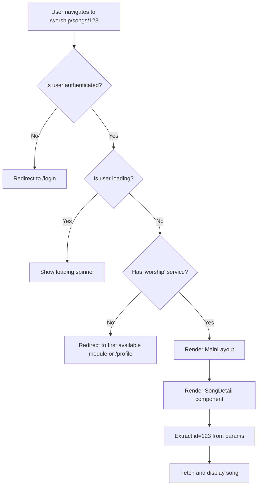

# Routing

MinistryHub uses **react-router-dom v7** to manage client-side navigation across its multi-hub architecture. The routing system implements sophisticated access control, module guards, and legacy redirects.

## Overview

The routing architecture is structured in three layers:

1. **Public Routes** - Accessible without authentication (login, forgot password, etc.)
2. **Protected Routes** - Require authentication via `ProtectedRoute` wrapper
3. **Module Routes** - Require both authentication and module-specific permissions via `ModuleGuard`

## Route Hierarchy

Here's the complete route structure from `frontend/src/App.tsx:67-140`:

```tsx title="frontend/src/App.tsx (Routes)"
<BrowserRouter>
  <Routes>
    {/* Public Routes */}
    <Route index element={<Home />} />
    <Route path="/login" element={<Login />} />
    <Route path="/forgot-password" element={<ForgotPassword />} />
    <Route path="/reset-password" element={<ResetPassword />} />
    <Route path="/pricing" element={<Pricing />} />
    <Route path="/auth/google/callback" element={<GoogleCallback />} />
    <Route path="/accept-invite" element={<AcceptInvite />} />

    <Route element={<ProtectedRoute />}>
      <Route element={<MainLayout />}>
        {/* Global / Selection Dashboard */}
        <Route path="dashboard" element={<MainDashboard />} />
        <Route path="profile" element={<Profile />} />
        <Route path="settings" element={<Settings />} />
        
        {/* Worship Hub */}
        <Route path="worship" element={<ModuleGuard moduleKey="worship" />}>
          <Route index element={<WorshipDashboard />} />
          <Route path="songs" element={<SongList />} />
          <Route path="songs/new" element={<SongEditor />} />
          <Route path="songs/:id" element={<SongDetail />} />
          <Route path="songs/:id/edit" element={<SongEditor />} />
          <Route path="playlists" element={<Playlists />} />
          <Route path="calendar" element={<CalendarPage />} />
        </Route>
        
        {/* MainHub (Pastoral/Admin) */}
        <Route path="mainhub" element={<ModuleGuard moduleKey="mainhub" />}>
          <Route index element={<MainHubDashboard />} />
          <Route path="people" element={<PeopleList />} />
          <Route path="teams" element={<TeamsList />} />
          <Route path="reports" element={<Reports />} />
          <Route path="admin/permissions" element={<PermissionsManager />} />
        </Route>
        
        {/* Social Hub */}
        <Route path="social" element={<ModuleGuard moduleKey="social" />}>
          <Route index element={<SocialDashboard />} />
        </Route>
        
        {/* Legacy Redirects */}
        <Route path="songs/*" element={<Navigate to="/worship/songs" replace />} />
        <Route path="people/*" element={<Navigate to="/mainhub/people" replace />} />
      </Route>
    </Route>

    <Route path="*" element={<Navigate to="/" replace />} />
  </Routes>
</BrowserRouter>
```

## Route Protection

### Protected Route Component

The `ProtectedRoute` component ensures users are authenticated before accessing any internal routes:

```tsx title="frontend/src/components/layout/ProtectedRoute.tsx"
import type { FC } from 'react';
import { Navigate, Outlet } from 'react-router-dom';
import { useAuth } from '../../hooks/useAuth';

export const ProtectedRoute: FC = () => {
  const { isAuthenticated, isLoading } = useAuth();

  if (isLoading) {
    return (
      <div style={{ 
        display: 'flex', 
        height: '100vh', 
        alignItems: 'center', 
        justifyContent: 'center' 
      }}>
        Loading...
      </div>
    );
  }

  if (!isAuthenticated) {
    return <Navigate to="/login" replace />;
  }

  return <Outlet />;
};
```

**Key Features:**
- Shows loading state while authentication is being verified
- Redirects unauthenticated users to `/login`
- Uses `<Outlet />` to render nested routes
- Preserves the replace behavior to prevent back-button issues

<Note>
  The `replace` prop prevents users from navigating back to protected routes after logout.
</Note>

### Module Guard Component

The `ModuleGuard` adds an additional layer of access control based on user permissions:

```tsx title="frontend/src/components/layout/ModuleGuard.tsx"
import type { FC } from 'react';
import { Navigate, Outlet } from 'react-router-dom';
import { useAuth } from '../../hooks/useAuth';

interface ModuleGuardProps {
  moduleKey: string;
}

export const ModuleGuard: FC<ModuleGuardProps> = ({ moduleKey }) => {
  const { services, isAuthenticated, isSuperAdmin, hasService } = useAuth();

  if (!isAuthenticated) {
    return <Navigate to="/login" replace />;
  }

  // Master/Superadmin has access to everything
  if (isSuperAdmin || hasService(moduleKey)) {
    return <Outlet />;
  }

  // Redirect to their first available module, or profile if none
  const firstModule = services.length > 0 ? services[0] : undefined;
  return <Navigate to={firstModule ? `/${firstModule}` : "/profile"} replace />;
};
```

**Access Control Logic:**
1. Verify user is authenticated
2. Grant access if user is a superadmin/master (has all permissions)
3. Check if user has the specific module enabled via `hasService(moduleKey)`
4. If denied, redirect to their first available module or profile page

<Warning>
  Module keys (`worship`, `mainhub`, `social`) must match the service keys returned by the backend bootstrap endpoint.
</Warning>

## Module Routes

### Worship Module

The Worship module handles song management, playlists, and worship calendar:

```tsx
<Route path="worship" element={<ModuleGuard moduleKey="worship" />}>
  <Route index element={<WorshipDashboard />} />              {/* /worship */}
  <Route path="songs" element={<SongList />} />              {/* /worship/songs */}
  <Route path="songs/new" element={<SongEditor />} />        {/* /worship/songs/new */}
  <Route path="songs/:id" element={<SongDetail />} />        {/* /worship/songs/123 */}
  <Route path="songs/:id/edit" element={<SongEditor />} />   {/* /worship/songs/123/edit */}
  <Route path="songs/approvals" element={<PendingApprovals />} />
  <Route path="playlists" element={<Playlists />} />
  <Route path="playlists/:id" element={<PlaylistDetail />} />
  <Route path="calendar" element={<CalendarPage />} />
</Route>
```

**Dynamic Route Parameters:**
- `:id` - Song or playlist ID
- Access via `useParams()` hook: `const { id } = useParams();`

### MainHub Module

MainHub manages people, teams, churches, and administrative functions:

```tsx
<Route path="mainhub" element={<ModuleGuard moduleKey="mainhub" />}>
  <Route index element={<MainHubDashboard />} />
  <Route path="people" element={<PeopleList />} />
  <Route path="people/approvals" element={<MemberApprovals />} />
  <Route path="people/invite" element={<InvitePerson />} />
  <Route path="teams" element={<TeamsList />} />
  <Route path="reports" element={<Reports />} />
  <Route path="churches" element={<ChurchList />} />
  <Route path="churches/new" element={<ChurchEditor />} />
  <Route path="churches/edit/:id" element={<ChurchEditor />} />
  <Route path="admin/permissions" element={<PermissionsManager />} />
</Route>
```

**Nested Administrative Routes:**
- `/mainhub/admin/permissions` - Only accessible to superadmins
- `/mainhub/people/approvals` - Member approval moderation queue

### Social Module

Currently in development, the Social module will handle communications:

```tsx
<Route path="social" element={<ModuleGuard moduleKey="social" />}>
  <Route index element={<SocialDashboard />} />
</Route>
```

## Navigation Patterns

### Programmatic Navigation

Use the `useNavigate` hook for programmatic navigation:

```tsx
import { useNavigate } from 'react-router-dom';

const MyComponent = () => {
  const navigate = useNavigate();
  
  const handleSave = () => {
    // Save logic...
    navigate('/worship/songs'); // Navigate to songs list
  };
  
  const goBack = () => {
    navigate(-1); // Go back one page
  };
  
  return (
    <button onClick={handleSave}>Save</button>
  );
};
```

### Link Components

For declarative navigation, use `Link` or `NavLink`:

```tsx
import { Link, NavLink } from 'react-router-dom';

// Basic link
<Link to="/worship/songs">View Songs</Link>

// NavLink with active state styling
<NavLink 
  to="/worship/songs" 
  className={({ isActive }) => isActive ? 'active' : ''}
>
  Songs
</NavLink>
```

### URL Parameters

Access dynamic route parameters with `useParams`:

```tsx
import { useParams } from 'react-router-dom';

const SongDetail = () => {
  const { id } = useParams(); // Extracts :id from /songs/:id
  
  // Fetch song with id...
  return <div>Song ID: {id}</div>;
};
```

### Query Parameters

Access and modify query strings with `useSearchParams`:

```tsx
import { useSearchParams } from 'react-router-dom';

const SongList = () => {
  const [searchParams, setSearchParams] = useSearchParams();
  
  const filter = searchParams.get('filter') || 'all';
  
  const setFilter = (newFilter: string) => {
    setSearchParams({ filter: newFilter });
  };
  
  return (
    <div>
      <p>Current filter: {filter}</p>
      <button onClick={() => setFilter('favorites')}>Show Favorites</button>
    </div>
  );
};
```

## Legacy Redirects

To maintain backward compatibility after the modular refactor, legacy routes redirect to new module-based paths:

```tsx title="frontend/src/App.tsx:129-135"
{/* Legacy Redirects for Backward Compatibility */}
<Route path="churches/*" element={<Navigate to="/mainhub/churches" replace />} />
<Route path="songs/*" element={<Navigate to="/worship/songs" replace />} />
<Route path="playlists/*" element={<Navigate to="/worship/playlists" replace />} />
<Route path="reunions/*" element={<Navigate to="/worship/calendar" replace />} />
<Route path="people/*" element={<Navigate to="/mainhub/people" replace />} />
<Route path="teams/*" element={<Navigate to="/mainhub/teams" replace />} />
```

<Tip>
  Legacy redirects ensure bookmarks and external links continue to work after refactoring.
</Tip>

## 404 Handling

Unmatched routes redirect to the home page:

```tsx
<Route path="*" element={<Navigate to="/" replace />} />
```

For better UX, consider creating a dedicated 404 page:

```tsx
<Route path="*" element={<NotFoundPage />} />
```

## Layout System

The `MainLayout` component wraps all authenticated routes and provides:

- Responsive header with user menu
- Desktop sidebar navigation
- Mobile bottom navigation
- Toast notification container
- Breadcrumb navigation

```tsx
<Route element={<ProtectedRoute />}>
  <Route element={<MainLayout />}>
    {/* All authenticated routes render inside MainLayout */}
  </Route>
</Route>
```

See the [MainLayout source](~/workspace/source/frontend/src/components/layout/MainLayout.tsx) for full implementation details.

## Route Access Control Flow

Here's how a request to `/worship/songs/123` is processed:



## Best Practices

### 1. Always Use Replace for Redirects

```tsx
// Good - prevents back button issues
<Navigate to="/login" replace />

// Bad - user can click back to protected route
<Navigate to="/login" />
```

### 2. Check Loading State

Always handle loading states in route guards:

```tsx
if (isLoading) {
  return <LoadingSpinner />;
}
```

### 3. Validate Parameters

Validate dynamic route parameters before using them:

```tsx
const { id } = useParams();

if (!id || isNaN(Number(id))) {
  return <Navigate to="/songs" replace />;
}
```

### 4. Use Nested Routes

Group related routes under a common parent:

```tsx
// Good - organized and maintainable
<Route path="songs">
  <Route index element={<SongList />} />
  <Route path=":id" element={<SongDetail />} />
  <Route path=":id/edit" element={<SongEditor />} />
</Route>

// Bad - repetitive and harder to refactor
<Route path="songs" element={<SongList />} />
<Route path="songs/:id" element={<SongDetail />} />
<Route path="songs/:id/edit" element={<SongEditor />} />
```

## Testing Routes

When testing components that use routing:

```tsx
import { BrowserRouter } from 'react-router-dom';
import { render } from '@testing-library/react';

const renderWithRouter = (component: React.ReactElement) => {
  return render(
    <BrowserRouter>
      {component}
    </BrowserRouter>
  );
};

// Usage
test('renders song detail', () => {
  renderWithRouter(<SongDetail />);
  // assertions...
});
```

## Next Steps

<CardGroup cols={2}>
  <Card title="React Structure" icon="react" href="/technical/react-structure">
    Learn about the overall React architecture
  </Card>
  <Card title="Authentication" icon="lock" href="/api/authentication">
    Understand JWT-based authentication and the AuthContext
  </Card>
  <Card title="Internationalization" icon="language" href="/technical/internationalization">
    Configure multi-language support with i18next
  </Card>
  <Card title="API Integration" icon="plug" href="/api/authentication">
    How routes interact with the backend API
  </Card>
</CardGroup>