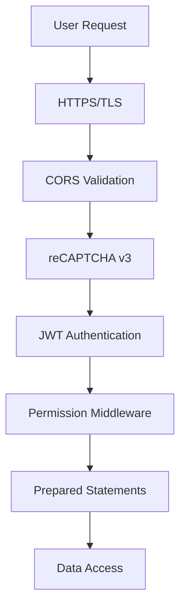

## Overview

MinistryHub implements a **defense-in-depth security strategy** with multiple layers protecting user data and system integrity.

---

## Security Layers



---

## 1. Infrastructure Security

### Folder Isolation

<Warning>
  The `backend/` folder is **never** accessible via URL. Only `public_html/` is exposed to the web.
</Warning>

**Server Structure:**
```text
/ (Server Root)
├── backend/                    # PRIVATE (unreachable via URL)
│   ├── config/
│   │   └── database.env        # Database credentials, secrets
│   ├── src/                    # PHP source code
│   └── logs/                   # Application logs
│
└── public_html/                # PUBLIC (document root)
    ├── api/
    │   └── index.php           # Single entry point
    ├── assets/                 # JS/CSS bundles
    └── index.html              # React SPA
```

**Why This Matters:**
- Attempting to visit `https://church.com/backend/config/database.env` returns **404 Not Found**
- Source code cannot be viewed via URL
- Secrets are protected even if `.htaccess` fails

### Environment Variables

**Never commit secrets to Git:**

```ini title="backend/config/database.env (excluded from Git)"
# Database Credentials
DB_HOST=localhost
DB_USER=ministryhub_user
DB_PASS=your-secure-password
DB_NAME=ministryhub_main

# Security Keys
JWT_SECRET=your-256-bit-random-secret
RECAPTCHA_SECRET_KEY=your-recaptcha-key
GOOGLE_CLIENT_ID=your-google-oauth-id
GOOGLE_CLIENT_SECRET=your-google-oauth-secret
```

**File Permissions:**
```bash
chmod 600 backend/config/database.env  # Owner read/write only
chmod 755 backend/logs                 # Writable by web server
```

---

## 2. Authentication

### JWT (JSON Web Tokens)

MinistryHub uses **stateless authentication** with custom JWT implementation.

#### Token Structure

```json
// Header
{
  "typ": "JWT",
  "alg": "HS256"
}

// Payload
{
  "uid": 42,                    // Member ID
  "email": "user@church.com",
  "iat": 1678901234,             // Issued at (timestamp)
  "exp": 1678904834              // Expires at (1 hour later)
}

// Signature (computed with HMAC-SHA256)
HMAC-SHA256(
  base64UrlEncode(header) + "." + base64UrlEncode(payload),
  JWT_SECRET
)
```

#### Token Generation

```php title="backend/src/Jwt.php"
class Jwt
{
    public static function encode($payload)
    {
        $header = json_encode(['typ' => 'JWT', 'alg' => 'HS256']);
        $base64UrlHeader = self::base64UrlEncode($header);
        $base64UrlPayload = self::base64UrlEncode(json_encode($payload));

        // Sign with secret key
        $signature = hash_hmac(
            'sha256',
            $base64UrlHeader . "." . $base64UrlPayload,
            self::getSecret(),
            true
        );
        $base64UrlSignature = self::base64UrlEncode($signature);

        return $base64UrlHeader . "." . $base64UrlPayload . "." . $base64UrlSignature;
    }

    private static function getSecret()
    {
        // Load from environment config
        $env = parse_ini_file(APP_ROOT . '/config/database.env');
        return $env['JWT_SECRET'] ?? 'default_secret';
    }
}
```

#### Token Validation

```php title="backend/src/Jwt.php"
public static function decode($token)
{
    $parts = explode('.', $token);
    if (count($parts) !== 3) {
        return null; // Invalid format
    }

    list($header, $payload, $signature) = $parts;

    // Verify signature
    $validSignature = hash_hmac(
        'sha256',
        $header . "." . $payload,
        self::getSecret(),
        true
    );

    if (self::base64UrlEncode($validSignature) !== $signature) {
        return null; // Signature mismatch
    }

    $decodedPayload = json_decode(self::base64UrlDecode($payload), true);

    // Check expiration
    if (isset($decodedPayload['exp']) && $decodedPayload['exp'] < time()) {
        return null; // Token expired
    }

    return $decodedPayload;
}
```

### Login Flow

<Steps>
  <Step title="User Submits Credentials">
    Frontend sends email, password, and reCAPTCHA token:
    ```typescript
    const response = await axios.post('/api/auth/login', {
      email: 'user@church.com',
      password: 'SecurePass123',
      recaptchaToken: recaptchaToken
    });
    ```
  </Step>

  <Step title="reCAPTCHA Verification">
    Backend validates reCAPTCHA before checking credentials:
    ```php title="backend/src/Controllers/AuthController.php"
    if (!$this->verifyRecaptcha($recaptchaToken)) {
        return Response::error("Verificación de seguridad fallida", 403);
    }
    ```
    See [Bot Protection](#4-bot-protection-recaptcha-v3) for details.
  </Step>

  <Step title="Database Lookup">
    ```php
    $user = UserRepo::findByEmail($email);
    if (!$user) {
        return Response::error("Credenciales inválidas", 401);
    }
    ```
  </Step>

  <Step title="Password Verification">
    ```php
    if (!password_verify($password, $user['password_hash'])) {
        Logger::error("Auth failed: Incorrect password for ($email)");
        return Response::error("Credenciales inválidas", 401);
    }
    ```
    Uses PHP's native bcrypt hashing.
  </Step>

  <Step title="Generate JWT">
    ```php
    $payload = [
        'uid' => $user['member_id'],
        'email' => $user['email'],
        'iat' => time(),
        'exp' => time() + 3600  // 1 hour expiration
    ];
    $token = Jwt::encode($payload);
    ```
  </Step>

  <Step title="Return Token">
    ```json
    {
      "success": true,
      "access_token": "eyJhbGciOiJIUzI1NiIsInR5cCI6IkpXVCJ9...",
      "expires_in": 3600
    }
    ```
  </Step>

  <Step title="Client Stores Token">
    ```typescript
    localStorage.setItem('access_token', response.data.access_token);
    ```
  </Step>
</Steps>

### Authentication Middleware

Every protected API request must include a valid JWT:

```php title="backend/src/Middleware/AuthMiddleware.php"
class AuthMiddleware
{
    public static function handle()
    {
        // Extract Authorization header
        $authHeader = '';
        
        // Try multiple sources (some hosts rewrite headers)
        if (!empty($_SERVER['HTTP_AUTHORIZATION'])) {
            $authHeader = $_SERVER['HTTP_AUTHORIZATION'];
        } elseif (!empty($_SERVER['REDIRECT_HTTP_AUTHORIZATION'])) {
            $authHeader = $_SERVER['REDIRECT_HTTP_AUTHORIZATION'];
        } elseif (!empty($_GET['token'])) {
            // Fallback for Server-Sent Events (SSE)
            $authHeader = 'Bearer ' . $_GET['token'];
        }

        // Validate Bearer format
        if (!preg_match('/Bearer\s(\S+)/', $authHeader, $matches)) {
            throw new \Exception("Token missing", 401);
        }

        $token = $matches[1];
        $decoded = Jwt::decode($token);

        if (!$decoded) {
            Logger::error("AuthMiddleware: Invalid token");
            throw new \Exception("Unauthorized", 401);
        }

        // Return authenticated user ID
        return $decoded['uid'];
    }
}
```

**Usage in Controllers:**

```php title="public_html/api/index.php"
// Public routes (no auth)
if ($resource === 'auth') {
    $controller = new AuthController();
    $controller->login();
    exit;
}

// Protected routes (auth required)
try {
    $memberId = AuthMiddleware::handle();
} catch (Exception $e) {
    Response::error($e->getMessage(), 401);
    exit;
}

// Now $memberId is available for all controllers
(new SongController())->handle($memberId, $action, $method);
```

---

## 3. Authorization (Permissions)

### Role-Based Access Control (RBAC)

MinistryHub uses **permissions** stored in the `roles` table:

```sql
CREATE TABLE roles (
    id INT AUTO_INCREMENT PRIMARY KEY,
    name VARCHAR(50) NOT NULL,
    church_id INT,
    permissions JSON,
    created_at TIMESTAMP DEFAULT CURRENT_TIMESTAMP
);
```

**Example Role:**
```json
{
  "id": 3,
  "name": "Worship Leader",
  "church_id": 5,
  "permissions": [
    "song.read",
    "song.create",
    "song.update",
    "playlist.create",
    "playlist.update"
  ]
}
```

### Permission Middleware

```php title="backend/src/Middleware/PermissionMiddleware.php"
class PermissionMiddleware
{
    /**
     * Check if user has a specific permission for a church
     */
    public static function require($memberId, $permission, $churchId = null)
    {
        // Superadmins bypass all checks
        if (PermissionRepo::isSuperAdmin($memberId)) {
            return true;
        }

        // Get member's role and permissions
        $member = UserRepo::getMemberData($memberId);
        $role = RoleRepo::findById($member['role_id']);

        if (!$role) {
            throw new \Exception("No role assigned", 403);
        }

        $permissions = json_decode($role['permissions'], true) ?? [];

        // Check if permission exists
        if (!in_array($permission, $permissions)) {
            Logger::error("Permission denied: $memberId lacks $permission");
            throw new \Exception(
                "No tienes permisos para realizar esta acción",
                403
            );
        }

        // Check church isolation (user can't access other churches' data)
        if ($churchId && $member['church_id'] != $churchId) {
            throw new \Exception("Access denied to this church", 403);
        }

        return true;
    }
}
```

**Usage in Controllers:**

```php title="backend/src/Controllers/SongController.php"
public function handle($memberId, $action, $method)
{
    $churchId = $_GET['church_id'] ?? null;

    if ($method === 'GET') {
        // Require read permission
        PermissionMiddleware::require($memberId, 'song.read', $churchId);
        $this->list($memberId, $churchId);
    }
    elseif ($method === 'POST') {
        // Require create permission
        PermissionMiddleware::require($memberId, 'song.create', $churchId);
        $this->create($memberId, $churchId, $data);
    }
    elseif ($method === 'DELETE') {
        // Require delete permission
        PermissionMiddleware::require($memberId, 'song.delete', $churchId);
        $this->delete($action);
    }
}
```

### Permission Hierarchy

| Permission | Description | Typical Role |
|------------|-------------|-------------|
| `song.read` | View songs | All worship team |
| `song.create` | Add new songs | Collaborators |
| `song.update` | Edit existing songs | Leaders |
| `song.delete` | Remove songs | Admin |
| `song.approve` | Approve suggested edits | Leaders |
| `people.read` | View member list | Leaders |
| `people.invite` | Invite new members | Admin |
| `admin.full` | Superadmin access | Pastor/IT |

---

## 4. Bot Protection: reCAPTCHA v3

### Why reCAPTCHA v3?

- **Invisible**: No user interaction required (no "Click all traffic lights")
- **Score-Based**: Returns a score from 0.0 (bot) to 1.0 (human)
- **Adaptive**: Learns from user behavior patterns

### Implementation

#### Frontend Integration

```typescript title="frontend/src/pages/LoginPage.tsx"
import { useEffect } from 'react';

function LoginPage() {
  useEffect(() => {
    // Load reCAPTCHA script
    const script = document.createElement('script');
    script.src = `https://www.google.com/recaptcha/api.js?render=${SITE_KEY}`;
    document.body.appendChild(script);
  }, []);

  const handleLogin = async () => {
    // Generate reCAPTCHA token
    const token = await grecaptcha.execute(SITE_KEY, { action: 'login' });

    // Send to backend
    const response = await axios.post('/api/auth/login', {
      email,
      password,
      recaptchaToken: token
    });
  };
}
```

#### Backend Verification

```php title="backend/src/Controllers/AuthController.php"
private function verifyRecaptcha($token)
{
    if (empty($token)) {
        Logger::warning("verifyRecaptcha: Empty token provided.");
        return false;
    }

    // Load secret from config
    $env = parse_ini_file(APP_ROOT . '/config/database.env');
    $secret = $env['RECAPTCHA_SECRET_KEY'] ?? '';

    if (empty($secret)) {
        return true; // No secret configured, skip check
    }

    // Call Google's API
    $url = 'https://www.google.com/recaptcha/api/siteverify';
    $data = [
        'secret' => $secret,
        'response' => $token
    ];

    $options = [
        'http' => [
            'header' => "Content-type: application/x-www-form-urlencoded\r\n",
            'method' => 'POST',
            'content' => http_build_query($data),
            'timeout' => 3.0
        ]
    ];

    $context = stream_context_create($options);
    $result = @file_get_contents($url, false, $context);

    if ($result === false) {
        // If Google's API is down, don't block the user
        Logger::warning("verifyRecaptcha: Google API request failed (timeout?).");
        return true;
    }

    $response = json_decode($result, true);

    // Check success and score (0.5 threshold)
    return $response['success'] && ($response['score'] ?? 1.0) >= 0.5;
}
```

### Score Interpretation

| Score Range | Interpretation | Action |
|-------------|----------------|--------|
| 0.9 - 1.0 | Very likely human | Allow |
| 0.5 - 0.9 | Probably human | Allow |
| 0.0 - 0.5 | Likely bot | **Reject** |

---

## 5. Database Security

### Prepared Statements

<Warning>
  MinistryHub **NEVER** concatenates user input into SQL queries.
</Warning>

**All queries use PDO prepared statements:**

```php
// ❌ VULNERABLE (SQL Injection)
$sql = "SELECT * FROM members WHERE email = '" . $_POST['email'] . "'";
$result = $db->query($sql);

// ✅ SECURE (Prepared Statement)
$sql = "SELECT * FROM members WHERE email = :email";
$stmt = $db->prepare($sql);
$stmt->bindValue(':email', $_POST['email']);
$stmt->execute();
$result = $stmt->fetch();
```

### Type Binding

```php
// Integer binding prevents type juggling attacks
$stmt->bindValue(':id', $id, PDO::PARAM_INT);

// Boolean binding
$stmt->bindValue(':is_active', true, PDO::PARAM_BOOL);
```

### Password Hashing

**Never store plain-text passwords:**

```php
// ❌ INSECURE
$password = $_POST['password'];
$sql = "INSERT INTO members (password) VALUES ('$password')";

// ✅ SECURE (bcrypt with automatic salt)
$hash = password_hash($_POST['password'], PASSWORD_BCRYPT);
$sql = "INSERT INTO members (password_hash) VALUES (:hash)";
$stmt->bindValue(':hash', $hash);
```

**Verification:**

```php
if (password_verify($inputPassword, $storedHash)) {
    // Password correct
}
```

---

## 6. CORS (Cross-Origin Resource Sharing)

### Why CORS?

During development, React runs on `localhost:5173` while the API is on a different origin. Browsers block cross-origin requests unless CORS headers are set.

### Implementation

```php title="backend/src/Helpers/Cors.php"
class Cors
{
    public static function init()
    {
        $origin = $_SERVER['HTTP_ORIGIN'] ?? '';
        
        // Whitelist allowed origins
        $allowed_origins = [
            'http://localhost:5173',              // Vite dev
            'http://localhost:4173',              // Vite preview
            'https://musicservicemanager.net',    // Production
            'https://www.musicservicemanager.net'
        ];

        // Only set header if origin is whitelisted
        if (in_array($origin, $allowed_origins)) {
            header("Access-Control-Allow-Origin: $origin");
            header("Access-Control-Allow-Credentials: true");
        }

        // Allow common HTTP methods
        header("Access-Control-Allow-Methods: GET, POST, OPTIONS, PUT, DELETE");
        
        // Allow authentication headers
        header("Access-Control-Allow-Headers: Content-Type, Authorization, X-Requested-With");

        // Handle preflight OPTIONS request
        if ($_SERVER['REQUEST_METHOD'] == 'OPTIONS') {
            http_response_code(200);
            exit;
        }
    }
}
```

**Initialized in bootstrap:**

```php title="backend/src/bootstrap.php"
\App\Helpers\Cors::init(); // First thing after autoloader
```

---

## 7. Input Validation

### Server-Side Validation

```php title="backend/src/Controllers/SongController.php"
private function create($memberId, $churchId, $data)
{
    // Validate required fields
    if (empty($data['title'])) {
        return Response::error("El título es obligatorio", 400);
    }

    if (empty($data['lyrics'])) {
        return Response::error("La letra es obligatoria", 400);
    }

    // Sanitize inputs
    $title = trim($data['title']);
    $artist = trim($data['artist'] ?? '');
    
    // Validate length
    if (strlen($title) > 255) {
        return Response::error("El título es demasiado largo (max 255 caracteres)", 400);
    }

    // Proceed with creation
    SongRepo::create([
        'title' => $title,
        'artist' => $artist,
        'lyrics' => $data['lyrics'],
        'church_id' => $churchId,
        'created_by' => $memberId
    ]);
}
```

### Client-Side Validation

```typescript title="frontend/src/components/SongForm.tsx"
const validateForm = () => {
  if (!title.trim()) {
    setError('El título es obligatorio');
    return false;
  }
  
  if (title.length > 255) {
    setError('El título es demasiado largo');
    return false;
  }
  
  return true;
};
```

<Note>
  Client-side validation is for UX. **Always validate on the server** as client checks can be bypassed.
</Note>

---

## 8. Logging & Monitoring

### Security Event Logging

```php title="backend/src/Helpers/Logger.php"
class Logger
{
    public static function error($message)
    {
        $logFile = APP_ROOT . '/logs/app.log';
        $timestamp = date('Y-m-d H:i:s');
        $entry = "[$timestamp] ERROR: $message\n";
        file_put_contents($logFile, $entry, FILE_APPEND);
    }

    public static function info($message)
    {
        $logFile = APP_ROOT . '/logs/app.log';
        $timestamp = date('Y-m-d H:i:s');
        $entry = "[$timestamp] INFO: $message\n";
        file_put_contents($logFile, $entry, FILE_APPEND);
    }
}
```

**Logged Events:**

```php
// Failed login attempts
Logger::error("Auth failed: Incorrect password for ($email)");

// Permission violations
Logger::error("Permission denied: $memberId lacks $permission");

// Database errors
Logger::error("Database Connection Error: " . $e->getMessage());

// Successful authentications
Logger::info("Auth success: User ($email) authenticated.");
```

---

## 9. HTTPS/TLS

<Warning>
  **Never deploy MinistryHub without HTTPS in production.** JWT tokens sent over HTTP can be intercepted.
</Warning>

### Let's Encrypt (Free SSL)

```bash
# Install Certbot
sudo apt-get install certbot python3-certbot-apache

# Generate certificate
sudo certbot --apache -d church.com -d www.church.com

# Auto-renewal
sudo certbot renew --dry-run
```

### Force HTTPS with .htaccess

```apache title="public_html/.htaccess"
RewriteEngine On

# Force HTTPS
RewriteCond %{HTTPS} off
RewriteRule ^(.*)$ https://%{HTTP_HOST}/$1 [R=301,L]

# API Routing
RewriteRule ^api/(.*)$ api/index.php [QSA,L]

# SPA Routing
RewriteCond %{REQUEST_FILENAME} !-f
RewriteCond %{REQUEST_FILENAME} !-d
RewriteRule . /index.html [L]
```

---

## 10. Multi-Tenancy Isolation

### Church Data Isolation

Every query includes `church_id` filtering:

```php
// Users can ONLY access their own church's data
$sql = "SELECT * FROM songs WHERE church_id = :church_id";
$stmt->bindValue(':church_id', $member['church_id'], PDO::PARAM_INT);
```

### Superadmin Override

```php
public static function getAll($churchId = null)
{
    $db = Database::getInstance('music');

    if ($churchId === null) {
        // Superadmin: no filter
        $sql = "SELECT * FROM songs";
        $stmt = $db->prepare($sql);
    } else {
        // Regular user: church filter
        $sql = "SELECT * FROM songs WHERE church_id = :church_id";
        $stmt = $db->prepare($sql);
        $stmt->bindValue(':church_id', $churchId, PDO::PARAM_INT);
    }

    $stmt->execute();
    return $stmt->fetchAll();
}
```

---

## Security Checklist

<Steps>
  <Step title="Environment Configuration">
    - [ ] `database.env` is outside `public_html/`
    - [ ] `database.env` has permissions `600`
    - [ ] `JWT_SECRET` is a strong random string (256-bit)
    - [ ] `.env` files are in `.gitignore`
  </Step>

  <Step title="Authentication">
    - [ ] All passwords use `password_hash()`
    - [ ] JWT tokens expire after 1 hour
    - [ ] Login endpoint uses reCAPTCHA v3
    - [ ] Authorization header is properly forwarded
  </Step>

  <Step title="Authorization">
    - [ ] All protected routes check `AuthMiddleware`
    - [ ] Controllers verify permissions before actions
    - [ ] Users cannot access other churches' data
  </Step>

  <Step title="Database">
    - [ ] All queries use prepared statements
    - [ ] No string concatenation in SQL
    - [ ] Sensitive errors are logged, not displayed
  </Step>

  <Step title="Transport">
    - [ ] HTTPS is enforced in production
    - [ ] CORS whitelist is configured
    - [ ] HTTP to HTTPS redirect is active
  </Step>

  <Step title="Monitoring">
    - [ ] Failed logins are logged
    - [ ] Permission violations are logged
    - [ ] Logs are rotated and backed up
  </Step>
</Steps>

---

## Common Attack Vectors & Mitigation

| Attack | How MinistryHub Protects |
|--------|---------------------------|
| **SQL Injection** | Prepared statements with named parameters |
| **XSS** | React escapes output by default; no `dangerouslySetInnerHTML` |
| **CSRF** | JWT in Authorization header (not cookies) |
| **Brute Force** | reCAPTCHA v3 + rate limiting via hosting |
| **Session Hijacking** | Stateless JWT; no server-side sessions |
| **Man-in-the-Middle** | HTTPS required in production |
| **Directory Traversal** | `backend/` folder unreachable via URL |
| **Credential Stuffing** | bcrypt hashing + reCAPTCHA |

---

## Next Steps

<CardGroup cols={2}>
  <Card title="Request Lifecycle" icon="route" href="/technical/request-lifecycle">
    See how security layers work in the request flow
  </Card>
  <Card title="Database" icon="database" href="/technical/database">
    Learn about prepared statements and data protection
  </Card>
  <Card title="Technology Stack" icon="layer-group" href="/technical/stack">
    Explore the security-focused tech choices
  </Card>
  <Card title="API Reference" icon="code" href="/api/authentication">
    View authentication requirements for each endpoint
  </Card>
</CardGroup>